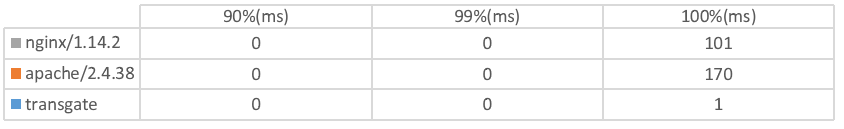
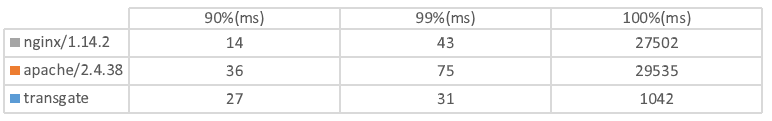

# transgate

```
 _____   _____        ___   __   _   _____   _____       ___   _____   _____  
|_   _| |  _  \      /   | |  \ | | /  ___/ /  ___|     /   | |_   _| | ____| 
  | |   | |_| |     / /| | |   \| | | |___  | |        / /| |   | |   | |__   
  | |   |  _  /    / / | | | |\   | \___  \ | |  _    / / | |   | |   |  __|  
  | |   | | \ \   / /  | | | | \  |  ___| | | |_| |  / /  | |   | |   | |___  
  |_|   |_|  \_\ /_/   |_| |_|  \_| /_____/ \_____/ /_/   |_|   |_|   |_____| 
```

Transgate is a web server running on Linux platform, it is written in C++ 14, currently supports handling HTTP/1.1 static GET requests as well as FastCGI requests, supports configuration of multiple sites, FastCGI, maximum idle time, etc. through configuration files.

## Advantages

1. High performance. Using multi-threaded asynchronous I/O multiplexing model, the request processing speed is faster.
2. Low occupancy, low leakage. Memory is managed by intelligent pointer, theoretically no memory leakage. Also memory has been reasonably pre-allocated, reducing unnecessary memory occupation.
3. Easy to configure. Using a single configuration file in JSON format, with the initial configuration document, there is no need to change too many configuration items under simple requirements.
4. Simple to run. It can be executed directly in the background to provide continuous Web services. 
5. High stability.

## Features

1. HTTP request parser (src/http/http_parser.*).
2. Support for handling normal GET requests.
3. Support for handling FastCGI requests (e.g. php-fpm).
4. Some HTTP 1.1 features, including long connections and maximum inactive connection time limits.

## Install & Run

Before installing, you need to make sure your machine is properly configured with cmake version 3.0 or higher, you can download and install cmake from the software repository.

``` bash
# Ubuntu
sudo apt-get install cmake

# Arch Linux
sudo pacman -S cmake
```

Before installing, you may need to ensure that your Linux kernel has full support for the `SO_REUSEPORT` feature. Then download the source code via `git` or other methods. After that, go to the source code directory and then execute this command

``` bash
mkdir build
cd build
cmake ..
make
sudo mkdir /etc/transgate
sudo cp ../transgate.json /etc/transgate
```

After that you can copy the `transgate` file in the `build` directory and execute it from anywhere.

## Config file description

The project root directory already has an example configuration file `transgate.json`, which is in json format and should be stored in the `/etc/transgate` directory. The meaning of each item under the configuration file is as follows.

`evloop/epoll_events`: Adjusts the number of events handled by Reactor at a time

`server/port`: Ports that the server listens on

`server/max_content_length`: Maximum Acceptable Content-Length

`server/keep_connection_time`: Maximum connection time without activity in 100ms

`server/instances`: Number of server threads, 0 means number of processor cores

`sites`: An array that represents the site

`[sites]/enable`: Is this site setting enabled

`[sites]/host`: Matching Hosts, <any> means all.

`[sites]/wwwroot`: Website root directory location

`[sites]/default_files`: Array, default file

`[sites]/forbidden_regexes`: Arrays, regular expressions forbidden to access

`[sites]/fastcgi`: An array representing FastCGI settings

`[sites]/[fastcgi]/enable`: Whether this FastCGI setting is enabled or not

`[sites]/[fastcgi]/mode`: FastCGI connection method, currently only `tcp` can be specified

`[sites]/[fastcgi]/gateway`: Gateway of FastCGI

`[sites]/[fastcgi]/port`: Port number of FastCGI

`[sites]/[fastcgi]/extends`: This setting corresponds to the extension-name of the configuration


## Performance Testing

### Test Environment

```
CPU: Core i7 6700HQ
Memory: 8 GiB
NIC: Realtek 1000M + Intel(R) Dual Band Wireless-AC 3165
OS: Arch Linux
```

### Test Item：WebBench v1.5

Command used for testing：
``` bash
./webbench http://127.0.0.1:<port>/ -2 --get -c <client numbers>
```

Comparison program: Apache Httpd/2.4.38


### Test Item：ApacheBench v2.3

#### 1 client

Command used for testing

``` bash
ab -n 500000 -c 1 http://127.0.0.1:<port>/
```

Comparison program: Apache Httpd/2.4.38 + Nginx 1.14.2

Completion time (less is better):


Number of requests completed per second (more is better):


Time spent per request (less is better):


Time to completion per percentage request (less is better):



#### 512 clients

Command used for testing:

``` bash
ab -n 500000 -c 512 http://127.0.0.1:<port>/
```

Comparison program: Apache Httpd/2.4.38 + Nginx 1.14.2

Completion time (less is better):


Number of requests completed per second (more is better):


Time spent per request (less is better):


Time to completion per percentage request (less is better):


