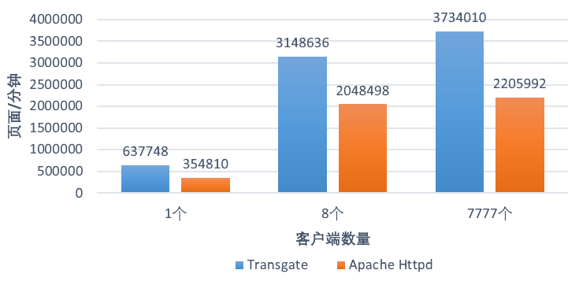
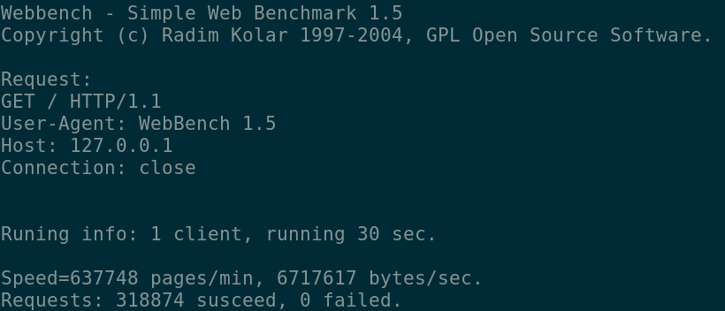
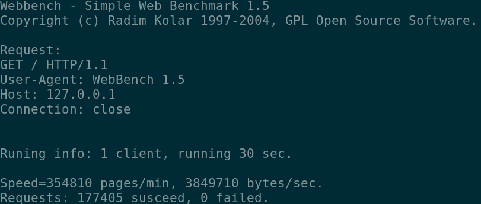
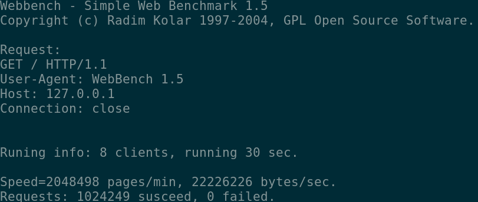
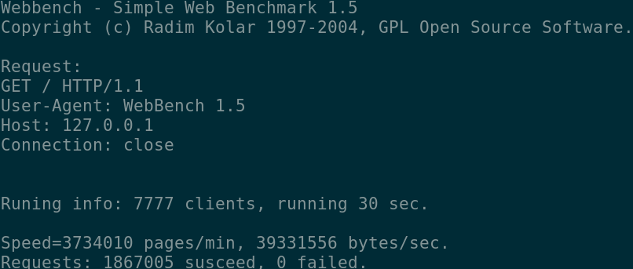
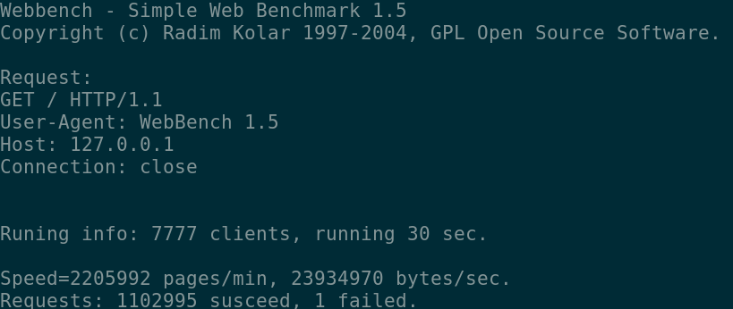

# transgate

```
 _____   _____        ___   __   _   _____   _____       ___   _____   _____  
|_   _| |  _  \      /   | |  \ | | /  ___/ /  ___|     /   | |_   _| | ____| 
  | |   | |_| |     / /| | |   \| | | |___  | |        / /| |   | |   | |__   
  | |   |  _  /    / / | | | |\   | \___  \ | |  _    / / | |   | |   |  __|  
  | |   | | \ \   / /  | | | | \  |  ___| | | |_| |  / /  | |   | |   | |___  
  |_|   |_|  \_\ /_/   |_| |_|  \_| /_____/ \_____/ /_/   |_|   |_|   |_____| 
```

transgate是一个运行于Linux平台上的Web服务器，它由C++ 14编写，目前支持处理HTTP/1.1的静态GET请求以及FastCGI请求，支持通过配置文件配置多站点、FastCGI、最长空闲时间等功能。

## 特点

1. 高性能。采用多线程异步I/O多路复用模型，请求处理速度较快。
2. 低占用，低泄露。内存采用智能指针管理，理论上无内存泄露。同时内存已进行合理的预分配，减少了不必要的内存占用。
3. 配置简易。使用JSON格式单配置文件，附带初始配置文档，简单需求下不需要更改过多的配置项。
4. 运行简单。直接在后台执行即可提供持续的Web服务。
5. 稳定性高。

## 特性

1. HTTP请求剖析器(src/http/http_parser.*)；
2. 支持处理普通GET请求；
3. 支持处理FastCGI请求(如php-fpm)；
4. HTTP 1.1部分特性，包括长连接及最长无活动连接时间限制；

## 安装和运行

安装前，你需要确保你的机器已经正确配置了cmake 3.0以上的版本，你可在软件源中下载并安装cmake。

``` bash
# Ubuntu
sudo apt-get install cmake
# Arch Linux
sudo pacman -S cmake
```

安装之前，你可能需要保证你的Linux内核已经完整支持了`SO_REUSEPORT`特性。然后通过`git`或其他方法下载源代码。之后进入源代码目录，然后执行以下命令完成安装：

``` bash
mkdir build
cd build
cmake ..
make
sudo mkdir /etc/transgate
sudo cp ../transgate.json /etc/transgate
```

之后你可拷贝`build`目录下的`transgate`文件并在任何地方执行它。

## 配置文件说明

项目根目录下已具有一示例性配置文件`transgate.json`，配置文件为json格式，并且应当存放在`/etc/transgate`目录下。配置文件下各个项目的意义如下：

`evloop/epoll_events`: 调节Reactor一次处理的事件数

`server/port`: 服务器监听的端口

`server/max_content_length`: 最长可接受的Content-Length 

`server/keep_connection_time`: 无活动状态下最长连接时间，单位100ms

`server/instances`: 服务器线程数，0表示处理器核心数

`sites`: 一个数组，表示站点

`[sites]/enable`: 该站点设置是否启用

`[sites]/host`: 匹配的Host，<any>表示所有。

`[sites]/wwwroot`: 网站根目录位置

`[sites]/default_files`: 数组，默认文件

`[sites]/forbidden_regexes`: 数组，禁止访问的正则表达式

`[sites]/fastcgi`: 一个数组，表示FastCGI设置

`[sites]/[fastcgi]/enable`: 该FastCGI设置是否启用

`[sites]/[fastcgi]/mode`: FastCGI连接方式，目前只能指定为`tcp`

`[sites]/[fastcgi]/gateway`: FastCGI的网关

`[sites]/[fastcgi]/port`: FastCGI的端口号

`[sites]/[fastcgi]/extends`: 该设置对应的配置拓展名


## 性能测试

### 测试环境

```
CPU: Core i7 6700HQ
内存：8 GiB
网卡：Realtek 1000M + Intel(R) Dual Band Wireless-AC 3165
操作系统：Arch Linux
测试项目：WebBench v1.5
```

### 测试结果

测试所用命令：
``` bash
./webbench http://127.0.0.1:<端口号>/ -2 --get -c <客户端数量>
```

对比对象：Apache Httpd/2.4.38

#### 结果图表



#### 1个客户端

**Transgate**: 637748 pages/min, 6717617 bytes/sec.


**Apache**: 354810 pages/min, 3849710 bytes/sec.


#### 8个客户端

**Transgate**: 3148636 pages/min, 33165654 bytes/sec.


**Apache**: 2048498 pages/min, 22226226 bytes/sec.


#### 7777个客户端

**Transgate**: 3734010 pages/min, 39331556 bytes/sec.


**Apache**: 2205992 pages/min, 23934970 bytes/sec.
